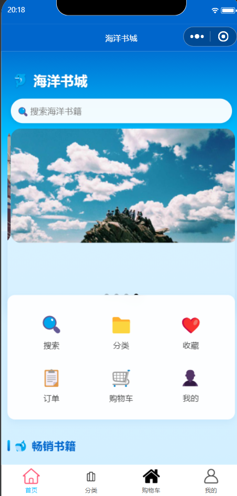
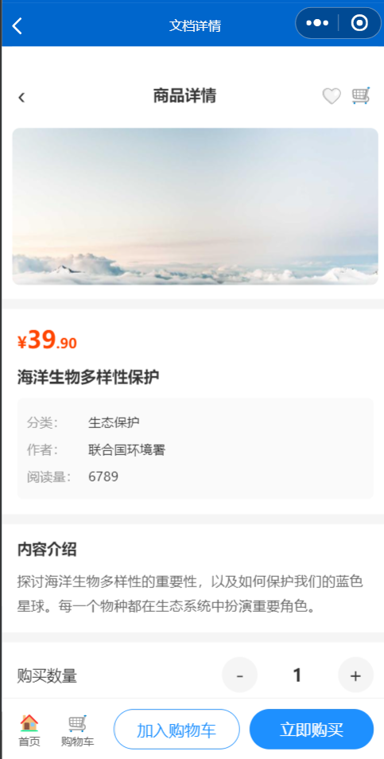
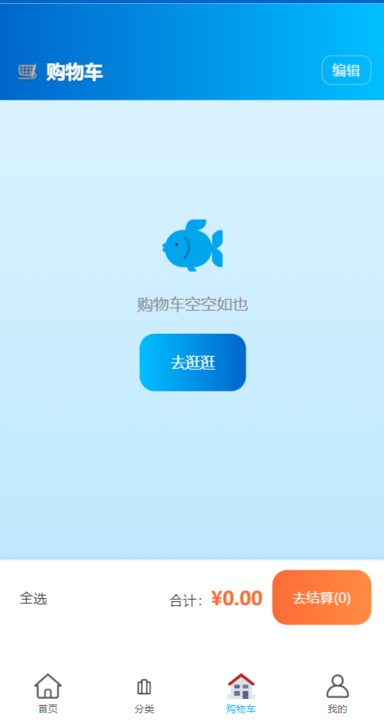
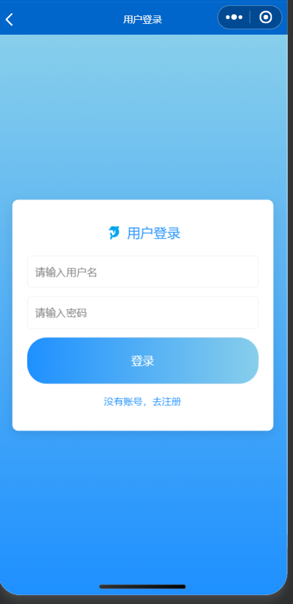

# 海洋书城 🐬

一个海洋主题的网上书城微信小程序，前后端完整可运行：商品浏览、搜索分类、购物车、**支付宝沙箱支付**、订单管理（批量取消、收货地址）、收藏、头像上传等。

> 个人独立开发项目，用于学习全栈开发流程。

## 项目预览

| 首页 | 分类 | 商品详情 |
|:---:|:---:|:---:|
|  |  |  |
| **购物车** | **用户登录** | **支付宝沙箱支付** |
|  |  |  |

## 功能特性

**小程序端**
- 首页轮播图、畅销榜 / 精选推荐 / 最新上架（后端真实数据，一次请求本地分片）
- 分类浏览、关键词搜索、商品详情
- 购物车（多选、全选、批量删除、实时合计）
- 下单填写收货地址，订单列表支持**批量取消**（自动归还库存）
- 支付宝沙箱支付完整流程（下单 → 跳转支付页 → 回调改状态）
- 收藏、头像上传、个人资料编辑
- JWT 登录态，过期自动跳转登录页

**后端**
- Spring Security + JWT 认证
- MyBatis-Plus 数据访问，BCrypt 密码加密
- 支付宝沙箱异步回调（notify_url）验证支付结果
- 文件上传与静态资源映射

## 技术栈

| 端 | 技术 |
|----|------|
| 小程序 | uni-app + Vue 3 + Vite |
| 后端 | Spring Boot 2.6 + Spring Security + MyBatis-Plus |
| 数据库 | MySQL 8.x |
| 支付 | 支付宝开放平台沙箱环境 |

## 项目结构

```
├── wiki1/     小程序前端（uni-app）
│   └── src/pages/       各页面源码
│   └── src/utils/api.js 统一管理后端地址与请求封装
└── wikipro/   后端服务（Spring Boot）
    └── src/main/java/   controller / service / mapper / entity
    └── schema.sql       建表脚本
    └── data.sql         示例数据
```

## 快速开始

### 1. 准备数据库

安装 MySQL 8.x，创建数据库 `shopdb`，依次执行 `wikipro/src/main/resources` 下的 `schema.sql` 和 `data.sql`（含示例账号 admin / 123456）。

### 2. 配置并启动后端

编辑 `wikipro/src/main/resources/application.properties`：

- 填写数据库密码
- 在 [支付宝开放平台沙箱](https://openhome.alipay.com/develop/sandbox/app) 申请 APPID、应用私钥、支付宝公钥并填入
- `JWTUtils.java` 中的 JWT 密钥请替换为自己的随机字符串

```bash
cd wikipro
mvn spring-boot:run
```

### 3. 编译小程序

```bash
cd wiki1
npm install
```

编辑 `src/utils/api.js`，将 IP 改为你电脑的局域网 IP（`ipconfig` 查看 IPv4 地址），然后：

```bash
npm run dev:mp-weixin
```

用微信开发者工具导入 `wiki1/dist/dev/mp-weixin` 目录即可运行。

## 支付回调说明

支付宝沙箱支付需要一个公网回调地址，本地开发可用 natapp 等内网穿透工具：

1. 启动内网穿透，获得公网域名
2. 替换 `application.properties` 中的 `alipay.notify-url` / `alipay.return-url`
3. 替换前端 `payForm.vue` 中的支付跳转域名

## 注意事项

- 本仓库**不包含**任何密钥：支付宝密钥、数据库密码、JWT 密钥均需自行配置
- 项目仅用于学习交流
